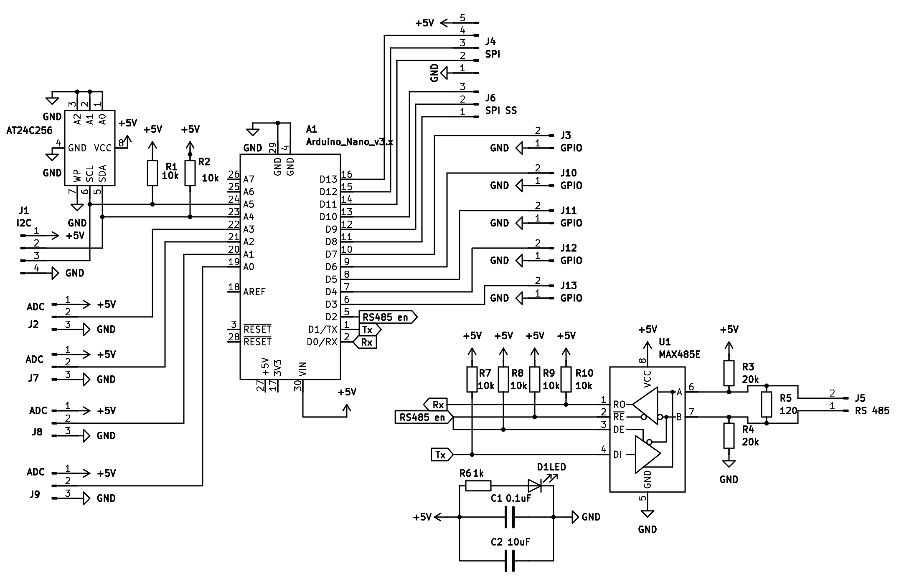

# Hardware

# Building

Firmware-ul a fost compilat și încărcat cu ajutorul PlatformIO, folosind tool-urile integrate .

# Dockerfiles

Directorul conține un fișier docker-compose pentru  [home assistant](https://www.home-assistant.io/), luat de pe pagina lor. Acesta poate fi rulat cu comanda:

``
docker-compose -f home_assistant.yaml up
``

Sub-directorul "config" conține configurări pentru citirea senzorilor BMP180, MAX6675, ACS712 și intrări/ieșiri discrete.

# Proceduri de configurare

Toate secțiunile folosesc regiștrii indexați începând cu `0`, iar ordinea biților de validitate este întotdeauna de la **LSB** spre **MSB**.

## Comunicare

* **Setare adresă Modbus (implicit 247)** – se scrie o valoare din intervalul `[1, 247]` în registrul Holding `MODBUS_ADDR` (adresa Holding `0`).
* **Modul de transmisie (implicit RTU)** – se scrie în registrul Holding `MODBUS_MODE` (adresa Holding `1`) una dintre următoarele valori:

  * `MODBUS_RTU` = 0
  * `MODBUS_ASCII` = 1
* **Viteza de comunicare RS485 (implicit 19.2kps)** – se scrie în registrul Holding `RS485_BAUD` (adresa Holding `2`) unul dintre indicii prezentați în tabelul:

| Index | Viteză [bps] | Timeout [ms] |
|------:|-------------:|-------------:|
| 0  | 1200   | 32   |
| 1  | 2400   | 16   |
| 2  | 4800   | 8    |
| 3  | 9600   | 4    |
| 4  | 14400  | 2.7  |
| 5  | 19200  | 2    |
| 6  | 28800  | 1.75 |
| 7  | 38400  | 1.75 |
| 8  | 57600  | 1.75 |
| 9  | 76800  | 1.75 |
| 10 | 115200 | 1.75 |

* **Paritatea RS485 (implicit EVEN)** – se scrie în registrul Holding `RS485_PARITY` (adresa Holding `3`) una dintre următoarele valori:

  * `NO_PARITY` = 0
  * `PARITY_EVEN` = 2
  * `PARITY_ODD` = 3

## Intrări/ieșiri discrete

Intrările și ieșirile discrete de tip GPIO împart spațiul de adrese `0–4` în cadrul bobinelor și intrărilor discrete.

Configurare:

* **Setare pin `i` ca bobină** – se scrie o valoare în registrul Holding `COIL_ADDR` (adresa Holding `4`) în care bitul `i` are valoarea `1`.
* **Setare pin `i` ca intrare discretă** – se scrie o valoare în registrul Holding `INPUT_ADDR` (adresa Holding `5`) în care bitul `i` are valoarea `1`.

## Senzori analogici

Valorile oferite de acești senzori sunt disponibile în regiștrii **Input** cu adresele `0–3`, corespunzătoare canalelor `0–3` ale convertorului intern.

Configurare:

* **Activarea canalului `i`** – se scrie o valoare în registrul Holding `ADC_IN_ADDR` (adresa Holding `6`) în care bitul `i` are valoarea `1`.

## Senzori SPI

Pinii impliciți destinați pentru SPI *slave-select* sunt `PB2–PB0`, indexați în ordine descrescătoare.

În această secțiune, senzorii vor fi numerotați folosind variabila `k, k ∈ [0, NUM_SPI - 1]`.

Valoarea oferită de senzorul `k` este disponibilă în registrul **Input** cu adresa `4 + k`.

### Configurare

1. Activarea senzorului `k` – se scrie o valoare în registrul Holding `SPI_SS_ADDR` (adresa Holding `7`) în care bitul `k` are valoarea `1`.

#### Pentru senzori care necesită date în aceeași tranzacție cu citirea

2. Adăugarea de date în buffer-ul senzorului `k` – se scrie o valoare `<= 0xFF` în registrul Holding `SPI_k_DELAY`,  aflat la adresa `8 + k * SPI_SLAVE_SIZE`.

#### Pentru senzori/actuatori care necesită transmisie separată

3. Adăugarea delay-ului pentru senzorul `k` – se scrie o valoare (în milisecunde) în registrul Holding `SPI_k_DELAY`, la adresa `8 + k * SPI_SLAVE_SIZE`.

4. Transmisia datelor către senzorul `k` – se scrie valoarea `1` în bobina cu adresa `5 + k`.

Această operație golește buffer-ul.

5. Re-adăugarea datelor pentru citire (dacă este cazul) – se scrie o valoare `<= 0xFF` în registrul Holding `SPI_k_DELAY`.

#### Utilizarea GPIO drept `slave-select`

Pentru extinderea numărului de senzori SPI peste numărul de pini `slave-select` disponibili:

1. Se setează bobina corespunzătoare la `0` pentru activarea senzorului.
2. Se realizează citirea senzorului.
3. Se setează bobina corespunzătoare la `1` pentru dezactivarea senzorului.

## Senzori I²C

Senzorii I²C vor fi indexați folosind variabila `j, 
j ∈ [0, NUM_TWI - 1]`.

Valorile furnizate de acești senzori sunt disponibile în registrul **Input** cu adresa`4 + NUM_SPI + j`.

### Configurare

1. Activarea senzorului `j` – se scrie adresa I²C în registrul Holding `TWI_j_SLAVE`, aflat la adresa `9 + NUM_SPI * SPI_SLAVE_SIZE + j * TWI_SLAVE_SIZE`.
Această operație setează automat la `1` bitul corespunzător din registrul Holding `VALID_TWI_ADDR`.

1.5. **Opțional**, dacă `TWI_j_SLAVE` conține o adresă validă, se poate scrie în registrul Holding `VALID_TWI_ADDR` (adresa:`8 + NUM_SPI * SPI_SLAVE_SIZE`) o valoare în care bitul `j` este `1`.

#### Pentru senzori care necesită date în aceeași tranzacție cu citirea

2. Adăugarea de date în buffer-ul senzorului `j` – se scrie o valoare `<= 0xFF` în registrul Holding `TWI_j_DATA`, aflat la adresa `9 + NUM_SPI * SPI_SLAVE_SIZE + j * TWI_SLAVE_SIZE + 3`.

#### Pentru senzori/actuatori care necesită transmisie separată

3. Adăugarea delay-ului pentru senzorul `j` – se scrie o valoare (în milisecunde) în registrul Holding `TWI_j_DELAY`, aflat la adresa `9 + NUM_SPI * SPI_SLAVE_SIZE + j * TWI_SLAVE_SIZE + 1`.

4. Transmisia datelor către senzorul `j` – se scrie valoarea `1` în bobina cu adresa `5 + NUM_SPI + j`.
Această operație golește buffer-ul.

5. Re-adăugarea datelor pentru citire (dacă este cazul) – se scrie o valoare `<= 0xFF` în registrul Holding `TWI_j_DATA`.
